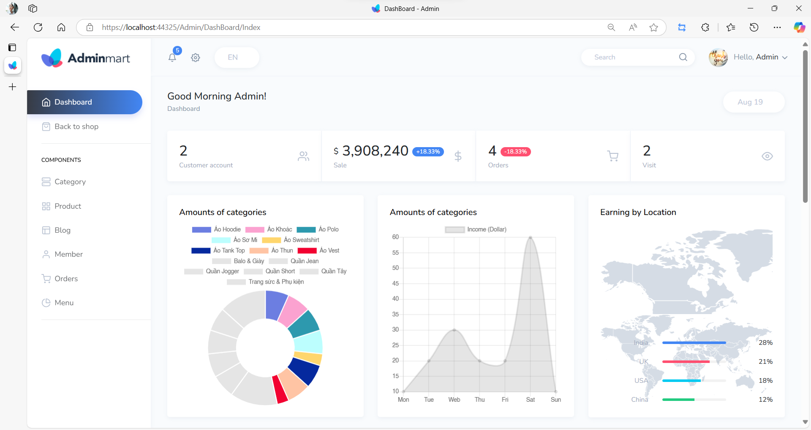
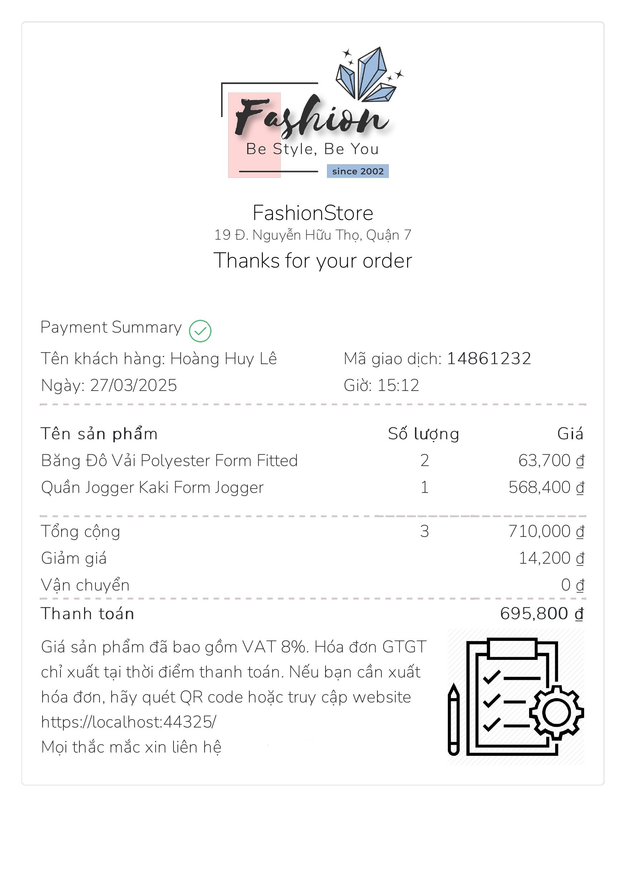

# The project create by ASP.NET MVC, SQL Server 

### Admin account
- username: admin  
- password: 123456
  
## Feature
### User site
- Login and register an account  
- Edit profile and change password  
- Search for products  
- Pagination  
- Filter and paginate products and categories  
- View product details  
- Shopping cart functionality  
- Track order progress and view order details  
- View SEO product articles and article details  
- Online payment with VNPay  
- Use reCAPTCHA v3 for site protection  
### Admin area
- Perform CRUD operations  
- Track order progress and update order statuses  
- Print bills  
- Manage menus with CRUD operations  
## Screenshots

  Thanh toán online với VNPay: 
  

  
   Trang chủ

  
   Admin area

  
   Biểu mẫu hóa đơn

